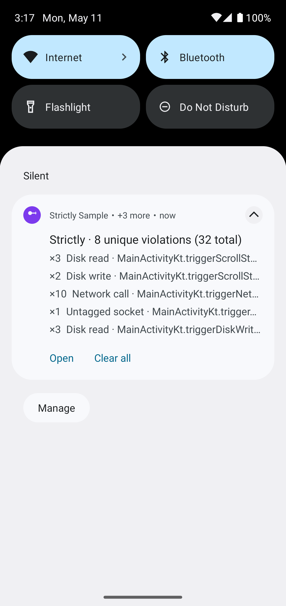
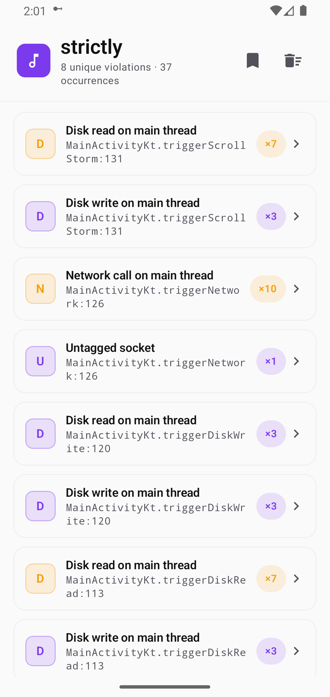
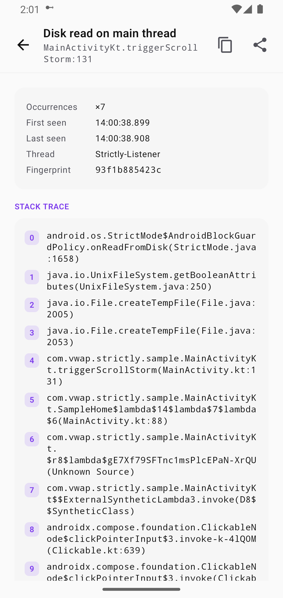
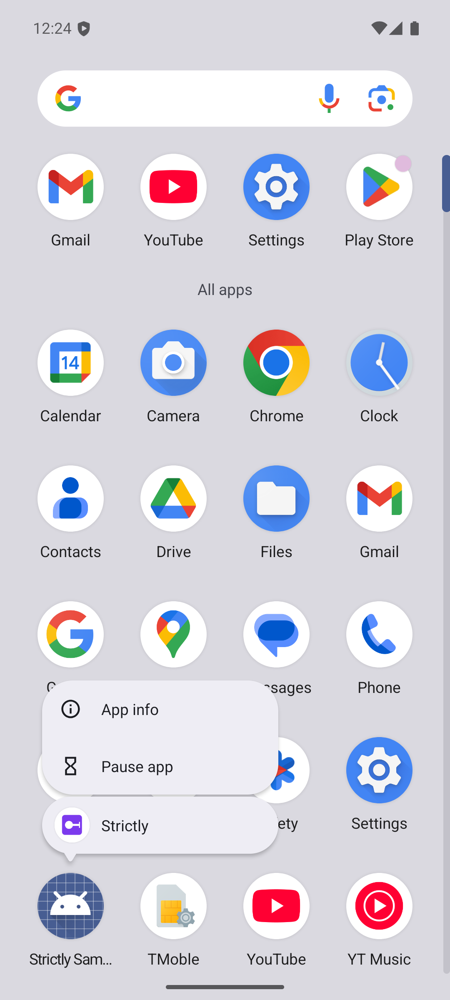

<h1 align="center">Strictly</h1>

<p align="center"><b>See every main-thread violation. Live.</b></p>

<p align="center">
  A debug-only Android library that turns StrictMode from a Logcat firehose into a Chucker-style live experience: one persistent notification, a Compose detail screen, plus a home-screen shortcut for one-tap access.
</p>

<p align="center">
  
</p>

## Install (two lines)

```kotlin
dependencies {
    debugImplementation("com.vwap.strictly:strictly:0.1.0")
    releaseImplementation("com.vwap.strictly:strictly-noop:0.1.0")
}
```

That's the entire setup. Zero `Application` subclass changes. Zero manifest edits. Zero `StrictMode.setThreadPolicy` calls. Strictly auto-installs via a `ContentProvider` and infers your app packages from `applicationId`.

## What you get

<table>
  <tr>
    <td width="50%" valign="top">
      
    </td>
    <td valign="top">
      <h3>Detail screen, de-duplicated</h3>
      <p>Every violation deduped into a single row with an occurrence count badge. Severity-first ordering. Tap the bookmark icon to <b>mark baseline</b>, useful on legacy codebases where you want to flag only new violations.</p>
    </td>
  </tr>
  <tr>
    <td valign="top">
      <h3>Per-violation detail</h3>
      <p>Plain-English violation type at the top. Metadata card with count, first / last seen, the thread that tripped it, plus a stable fingerprint. The first app frame is highlighted in the stack, so the line of code that caused it is one glance away.</p>
    </td>
    <td width="50%" valign="top">
      
    </td>
  </tr>
  <tr>
    <td width="50%" valign="top">
      
    </td>
    <td valign="top">
      <h3>Long-press shortcut</h3>
      <p>Long-press your app icon on the home screen. Tap <b>Strictly</b>. The detail screen opens. On API 33+, notification permission is requested the first time.</p>
    </td>
  </tr>
</table>

## Touch points

| Surface | When you see it | How to access |
|---|---|---|
| **Live notification** | As soon as the first violation fires | Pull down the shade |
| **Detail screen** | On demand | Tap the notification. Tap the app shortcut. Call `Strictly.openDetailScreen(context)` from code |
| **Long-press shortcut** | On launchers that support shortcuts | Long-press your app icon |
| **`Strictly.violations` flow** | Anywhere in code | `StateFlow<Map<fingerprint, Violation>>` for embedding into a debug menu |

## Production safety

Release builds wire the no-op artifact. Zero classes loaded. Zero ContentProvider registered. Zero notification channels created. Nothing about Strictly ships to users.

## Configure if you must

Defaults are tuned for "drop in, see violations, never spam". Override only if you need to.

```kotlin
class MyApplication : Application() {
    override fun onCreate() {
        super.onCreate()
        Strictly.install(
            this,
            StrictlyConfig(
                appPackages = listOf("com.acme.", "com.acme.lending."),
                ignoredPackages = StrictlyConfig.DEFAULT_IGNORED_PACKAGES + listOf(
                    "com.acme.thirdparty.",
                ),
                detectedTypes = ViolationType.entries.toSet() - ViolationType.ResourceMismatch,
                maxStoredViolations = 1000,
                notificationUpdateDebounceMillis = 500,
                registerAppShortcut = true,
                baselineModeEnabled = true,
            ),
        )
    }
}
```

| Setting | Default | Purpose |
|---|---|---|
| `appPackages` | inferred from `applicationId` | Frames matching these prefixes are highlighted, plus preferred for fingerprinting |
| `ignoredPackages` | small list of known-noisy framework SDKs | Violations whose first app-frame is in this list are silently dropped |
| `detectedTypes` | all | Trim to skip noisy detectors |
| `maxStoredViolations` | 500 | Bounded LRU. Oldest evicted when full |
| `notificationUpdateDebounceMillis` | 500 | Maximum notification update frequency under load |
| `registerAppShortcut` | true | Adds the long-press shortcut on launchers that support it |
| `baselineModeEnabled` | false | Mark current set as "accepted". Only new violations flagged afterward |

## Why Strictly

StrictMode is one of Android's most underused tools because its default output is awkward:

- `penaltyLog` floods Logcat where violations are easy to miss
- `penaltyDeath` crashes debug builds out of the dev's flow
- Per-violation toasts spam during scroll storms
- No way to see "everything I've tripped this session"

Strictly fixes the surface, not the policy. Under the hood it's still vanilla `StrictMode` with a custom `penaltyListener`. The listener routes into a de-duplicating store, a debounced notification, plus a Compose UI.

Pairs naturally with [LeakCanary](https://square.github.io/leakcanary/) (memory leaks) plus [Chucker](https://github.com/ChuckerTeam/chucker) (network).

## Comparison

| | LeakCanary | Chucker | **Strictly** |
|---|---|---|---|
| Detects | Memory leaks | Network calls | Main-thread violations plus VM violations |
| Surface | Notification + detail screen | Notification + detail screen | Notification + detail screen |
| Auto-init | yes | yes | yes |
| App shortcut | yes | yes | yes |
| No-op release artifact | yes | yes | yes |

## Requirements

- **minSdk 21** to compile. Strictly itself is debug-only.
- **API 28+** for the live notification plus detail UI. On API 21 through 27, Strictly installs a sensible Logcat-only policy. The UI surfaces are no-ops.
- **API 33+** prompts for `POST_NOTIFICATIONS` the first time you open the detail screen via the home-screen shortcut.

## Programmatic entry points

```kotlin
Strictly.openDetailScreen(context)   // jump straight to the UI
Strictly.markBaseline()              // freeze current set as "accepted"
Strictly.clear()                     // wipe the store and dismiss the notification
Strictly.violations                  // StateFlow<Map<fingerprint, Violation>>
Strictly.isLiveListeningSupported    // false on API < 28
```

<details>
<summary><b>How it works</b></summary>

```
StrictMode penaltyListener  ->  classify  ->  fingerprint  ->  ViolationStore (LRU)
                                                                      |
                                                                      +->  LiveNotificationController (debounced)
                                                                      |
                                                                      +->  StrictlyActivity (Compose StateFlow)
```

- A single-thread executor handles the `OnThreadViolationListener` plus `OnVmViolationListener` callbacks. Work per callback is small: classify the violation subtype by simple-class-name, map to a domain model, compute a fingerprint over the violation type plus the first 3 app-frames (classes only, no line numbers), upsert into the store.
- The store is a `StateFlow<Map<fingerprint, Violation>>` so both the notification plus the Compose UI subscribe without polling.
- The notification subscribes through a `debounce(500ms)` flow. A burst of 200 identical violations in 50ms produces one notification update.
- Self-instrumentation: the listener body runs inside `StrictMode.allowThreadDiskReads()` so Strictly never trips its own policy.

</details>

<details>
<summary><b>Opting out of auto-init</b></summary>

To install Strictly manually (eg: if you need to set your own config *before* the first user-code line runs), disable the bundled provider in your debug manifest:

```xml
<application>
    <provider
        android:name="com.vwap.strictly.internal.StrictlyAutoInitProvider"
        android:authorities="${applicationId}.strictly-auto-init"
        tools:node="remove" />
</application>
```

Then call `Strictly.install(this, yourConfig)` from your `Application.onCreate`.

</details>

## Roadmap

- Baseline file checked into the repo, with `assertNoNewViolations()` for instrumented tests
- Export violations as JSON / CSV for sharing in PRs
- Optional Room-backed store for cross-session persistence
- Filter chips in the detail screen (by type, by package, by severity)

## License

Apache 2.0. See [LICENSE](LICENSE) for the full text.
