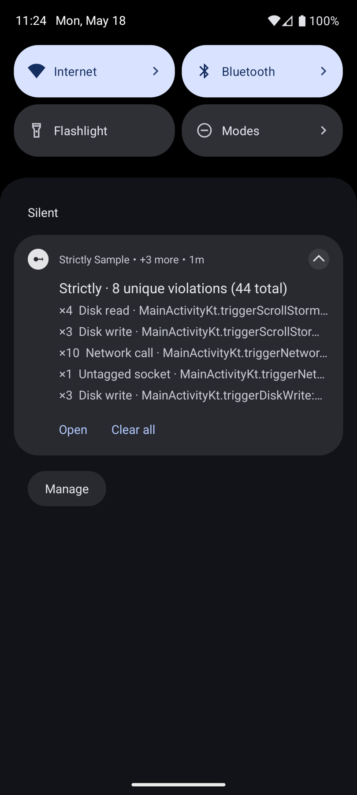
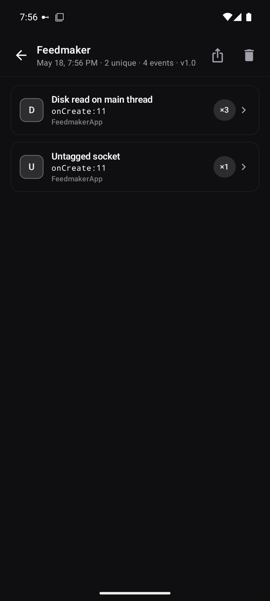
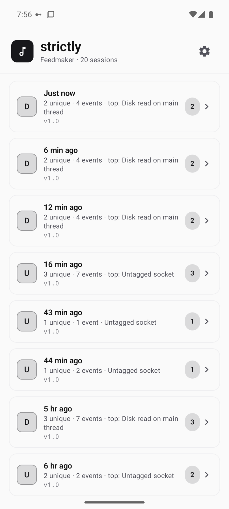
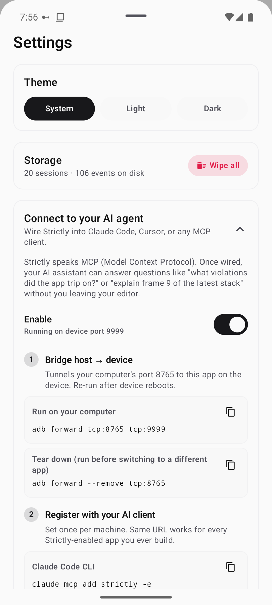

<h1 align="center">Strictly</h1>

<p align="center"><b>See every main-thread violation. Live.</b></p>

<p align="center">
  A debug-only Android library that turns StrictMode from a Logcat firehose into a Chucker-style live experience: one persistent notification, a Compose detail UI, an opt-in HTTP server that pipes violations to your AI coding agent over MCP.
</p>

<p align="center">
  <a href="https://central.sonatype.com/artifact/io.github.vinaywadhwa.strictly/strictly"></a>
  <a href="https://www.npmjs.com/package/strictly-mcp"></a>
  <a href="https://github.com/vinaywadhwa/Strictly/actions/workflows/ci.yml"></a>
  <a href="LICENSE"></a>
  
</p>

<p align="center">
  
</p>

## At a glance

- **Two dependency lines, zero code.** Auto-installs via a `ContentProvider`. No `Application` subclass changes. No manifest edits. No `StrictMode.setThreadPolicy` calls.
- **One persistent notification.** Deduplicates by stack fingerprint, debounced so a 200-violation scroll storm becomes one update.
- **A Compose UI on top of every violation.** Session list, per-session breakdown, per-violation stack with the first app-frame highlighted.
- **Cross-session history on disk.** Every app launch is a new session. LRU-bounded. Per-session JSON or Markdown export, ready for PR comments.
- **Talks to your AI agent.** Optional loopback HTTP server plus the [`strictly-mcp`](strictly-mcp/) npm package surface live violations to Claude Code / Cursor / any MCP-aware client.

Pairs naturally with [LeakCanary](https://square.github.io/leakcanary/) for memory leaks plus [Chucker](https://github.com/ChuckerTeam/chucker) for network.

## Install

```kotlin
dependencies {
    debugImplementation("io.github.vinaywadhwa.strictly:strictly:0.1.1")
    releaseImplementation("io.github.vinaywadhwa.strictly:strictly-noop:0.1.1")
}
```

That is the entire setup. Strictly infers your app packages from `applicationId` and installs a sensible `StrictMode` policy on first launch. Open your app, trip a violation (eg: an unintentional disk read on the main thread), watch the notification appear.

## The 60-second tour

<table>
  <tr>
    <td width="50%" valign="top">
      
    </td>
    <td valign="top">
      <h3>Session view, deduplicated</h3>
      <p>Every violation collapsed to a single row with an occurrence count badge (eg: <code>×3</code>). Severity-first ordering so the worst offender sits on top. The first app-frame is shown inline, so you can scan the stack location at a glance and tap to drill into the full trace. Pictured in dark mode: Strictly follows your system theme by default. You can pin Light or Dark in settings.</p>
    </td>
  </tr>
  <tr>
    <td valign="top">
      <h3>Sessions across process lifetimes</h3>
      <p>Every app launch starts a new session. The list shows them most-recently-active first, with a <b>Live</b> chip on the current one. Tap any row to drill into the violations that fired during that run. The current session is reactive: violations stream in as they happen. Past sessions persist in an LRU bounded by <code>maxStoredSessions</code> (default 50).</p>
    </td>
    <td width="50%" valign="top">
      
    </td>
  </tr>
  <tr>
    <td width="50%" valign="top">
      
    </td>
    <td valign="top">
      <h3>Settings, themes, plus AI-agent setup</h3>
      <p>Three cards. <b>Theme</b>: System / Light / Dark, persisted across launches. The default is also settable in <code>StrictlyConfig</code> so it survives uninstall. <b>Storage</b>: wipe all sessions with one tap, plus a live count of events on disk. <b>Connect to your AI agent</b>: copy-paste-ready <code>adb forward</code>, <code>claude mcp add</code>, plus an <code>mcp.json</code> snippet for any MCP client.</p>
    </td>
  </tr>
  <tr>
    <td valign="top">
      <h3>Per-violation detail</h3>
      <p>Plain-English violation type at the top. Metadata card with occurrence count, first / last seen, the thread that tripped it, plus a stable fingerprint useful for correlating with bug reports. The full stack trace below, with the first app-frame highlighted so the line of code that caused the violation is one glance away. Share-icon exports the session as JSON or Markdown.</p>
    </td>
    <td width="50%" valign="top">
      
      <p align="center"><sub>Long-press your app icon to jump straight to the Strictly UI.</sub></p>
    </td>
  </tr>
</table>

## Talk to your AI agent

Strictly ships a companion MCP server, [`strictly-mcp`](strictly-mcp/), that wraps the on-device HTTP server into three Model Context Protocol tools. Once wired up, ask your coding agent things like:

> "What disk reads is my app doing on the main thread right now?"
>
> "Diff the violations between this session and the previous one."
>
> "Show me the stack for that untagged socket and propose a fix."

Setup is two commands plus an in-app toggle:

```sh
adb forward tcp:8765 tcp:8765
claude mcp add strictly -e STRICTLY_URL=http://127.0.0.1:8765 -- npx -y strictly-mcp
```

Then in the app: open Strictly (via the home-screen shortcut or `Strictly.openDetailScreen(context)` in code), tap the gear icon, toggle **Enable** under *Connect to your AI agent*. The settings sheet also has a ready-to-paste `mcp.json` for non-Claude clients.

The host port is fixed at `8765` so your MCP config never drifts. The on-device port is derived deterministically from your `applicationId`, falling back through a small bind window if taken. The `adb forward` line bridges the two, so the same MCP entry works across every Strictly-enabled app you ever build.

The server binds loopback only. Off by default. No data leaves the device.

## Why does Strictly exist?

StrictMode is one of Android's most underused tools because its default output is awkward:

- `penaltyLog` floods Logcat where violations are easy to miss.
- `penaltyDeath` crashes debug builds out of the dev's flow.
- Per-violation toasts spam the screen during scroll storms.
- No way to see "everything I have tripped this session," let alone across sessions.

Strictly fixes the surface, not the policy. Under the hood it is still vanilla `StrictMode` with a custom `penaltyListener`. The listener routes into a de-duplicating store, a debounced notification, a Compose UI, plus an optional loopback HTTP server. Same policy, dramatically better feedback loop.

## How it compares

| | LeakCanary | Chucker | **Strictly** |
|---|---|---|---|
| Detects | Memory leaks | Network calls | Main-thread violations plus VM violations |
| Surface | Notification + detail screen | Notification + detail screen | Notification + detail screen |
| Auto-init | yes | yes | yes |
| Home-screen shortcut | yes | yes | yes |
| No-op release artifact | yes | yes | yes |
| Cross-session history | no | no | yes (LRU on disk) |
| Per-session export (JSON / Markdown) | no | no | yes |
| MCP server for AI agents | no | no | yes (`strictly-mcp` on npm) |

## Production safety

Release builds wire the no-op artifact. Zero classes loaded. Zero `ContentProvider` registered. Zero notification channels created. Nothing about Strictly ships to users. The no-op API mirrors the real API exactly, so calls like `Strictly.openDetailScreen(context)` or `Strictly.violations` compile and silently no-op in release.

## Requirements

- **minSdk 21** to compile. Strictly itself is debug-only.
- **API 28+** for the live notification plus detail UI. On API 21 through 27, Strictly installs a sensible Logcat-only policy. The UI surfaces are no-ops.
- **API 33+** prompts for `POST_NOTIFICATIONS` the first time you open the detail screen via the home-screen shortcut.

<details>
<summary><b>Configuration</b></summary>

Defaults are tuned for "drop in, see violations, never spam". You will almost never need to override anything. When you do:

```kotlin
class MyApplication : Application() {
    override fun onCreate() {
        super.onCreate()
        Strictly.install(
            this,
            StrictlyConfig(
                appPackages = listOf("com.acme.", "com.acme.lending."),
                ignoredPackages = StrictlyConfig.DEFAULT_IGNORED_PACKAGES + listOf(
                    "com.acme.thirdparty.",
                ),
                detectedTypes = ViolationType.entries.toSet() - ViolationType.ResourceMismatch,
                maxStoredSessions = 50,
                notificationUpdateDebounceMillis = 500,
                registerAppShortcut = true,
                themeMode = ThemeMode.System,
                httpDebugPort = null,
                httpDebugAutoStart = false,
                httpDebugSecret = null,
                askForNotificationPermission = true,
            ),
        )
    }
}
```

| Setting | Default | Purpose |
|---|---|---|
| `appPackages` | inferred from `applicationId` | Frames matching these prefixes are highlighted, plus preferred for fingerprinting |
| `ignoredPackages` | small list of known-noisy framework SDKs | Violations whose first app-frame is in this list are silently dropped |
| `detectedTypes` | all | Trim to skip noisy detectors |
| `maxStoredSessions` | 50 | Bounded LRU of archived sessions on disk. Oldest evicted when full |
| `notificationUpdateDebounceMillis` | 500 | Maximum notification update frequency under load |
| `registerAppShortcut` | true | Adds the long-press shortcut on launchers that support it |
| `themeMode` | `ThemeMode.System` | Default theme on first launch. User override in settings persists. Setting this in code is useful because SharedPreferences are wiped on uninstall but config-side defaults live in your source tree |
| `httpDebugPort` | `null` (derived from `applicationId`) | Force a specific on-device port. Set explicitly only if you need a known port for scripting |
| `httpDebugAutoStart` | false | Start the HTTP server on `Strictly.install` (eg: useful in CI) without requiring the in-app toggle |
| `httpDebugSecret` | null | Optional `X-Strictly-Secret` header. Belt-and-braces over loopback isolation |
| `askForNotificationPermission` | true | On API 33+, auto-prompt for `POST_NOTIFICATIONS` on first violation. Disable if your app prompts separately |

</details>

<details>
<summary><b>Programmatic API</b></summary>

```kotlin
Strictly.openDetailScreen(context)          // jump straight to the UI
Strictly.violations                         // StateFlow<Map<fingerprint, Violation>> for the live session
Strictly.sessions                           // StateFlow<List<SessionSummary>> across all persisted sessions
Strictly.currentSessionId                   // String, useful for correlating with crash reports
Strictly.loadSession(id)                    // Session? from live or archived storage
Strictly.clearCurrent()                     // wipe the live session
Strictly.deleteSession(id)                  // delete a specific archived session
Strictly.wipeAllSessions()                  // nuke everything from disk and memory
Strictly.isLiveListeningSupported           // false on API < 28

Strictly.DebugHttp.setEnabled(true)         // turn on the HTTP server programmatically
Strictly.DebugHttp.running                  // StateFlow<Boolean>
Strictly.DebugHttp.port                     // StateFlow<Int>: the actual bound port (anchor or fallback)
Strictly.DebugHttp.hasSecret                // StateFlow<Boolean>
Strictly.DebugHttp.lastError                // StateFlow<String?> for last bind / runtime error
Strictly.DebugHttp.retry()                  // retry after a bind failure
```

The no-op artifact exposes the same surface, so every line above compiles in release builds and silently does nothing.

</details>

<details>
<summary><b>How it works</b></summary>

```
StrictMode listener  ->  classify  ->  fingerprint  ->  SessionStore (LRU on disk + StateFlow)
                                                                |
                                                                +->  LiveNotificationController (debounced 500ms)
                                                                |
                                                                +->  StrictlyActivity (Compose state machine)
                                                                |
                                                                +->  StrictlyHttpServer (opt-in, loopback)  ->  strictly-mcp
```

- A single-thread executor handles the `OnThreadViolationListener` plus `OnVmViolationListener` callbacks. Per-callback work stays small. Classify the subtype by simple-class-name. Map to a domain model. Compute a fingerprint over the violation type plus the first 3 app-frames (classes only, no line numbers, so reformats don't invalidate). Upsert into the store.
- `SessionStore` exposes the live session as a `StateFlow<Map<fingerprint, Violation>>`. Three surfaces subscribe to that flow: the notification, the Compose UI, plus the HTTP debug server. No polling anywhere.
- The notification subscribes through a `debounce(500ms)` flow. A burst of 200 identical violations in 50ms produces one notification update.
- Past sessions persist to an LRU on disk (bounded by `maxStoredSessions`). On launch the index loads first. Individual session bodies load on demand.
- The HTTP debug server is opt-in and loopback-only. It serves the same JSON the file persister writes. The `strictly-mcp` Node process wraps it as three MCP tools. The host port is fixed at `8765`. The on-device port is derived deterministically from your `applicationId` (in the 8700 to 8799 band) so multiple Strictly-enabled apps on the same device don't collide. Bind failures fall through a small window before giving up.
- Self-instrumentation: the listener body runs inside `StrictMode.allowThreadDiskReads()`, plus the HTTP server tags its own sockets via `TrafficStats.setThreadStatsTag`, so Strictly never trips its own policy.
- The on-disk schema is pinned by a golden test. Bumping it requires a deliberate code change plus a snapshot update.

</details>

<details>
<summary><b>Opting out of auto-init</b></summary>

To install Strictly manually (eg: if you need to set your own config *before* the first user-code line runs), disable the bundled provider in your debug manifest:

```xml
<application>
    <provider
        android:name="com.vwap.strictly.internal.StrictlyAutoInitProvider"
        android:authorities="${applicationId}.strictly-auto-init"
        tools:node="remove" />
</application>
```

Then call `Strictly.install(this, yourConfig)` from your `Application.onCreate`.

</details>

## Roadmap

- Baseline file checked into the repo, with `assertNoNewViolations()` for instrumented tests.
- Cross-session diff screen: "what is new since the last clean run".
- Filter chips in the session view (by type, by package, by severity).
- A first-class CI mode that fails the build on net-new violations against a checked-in baseline.

## License

Apache 2.0. See [LICENSE](LICENSE) for the full text.
