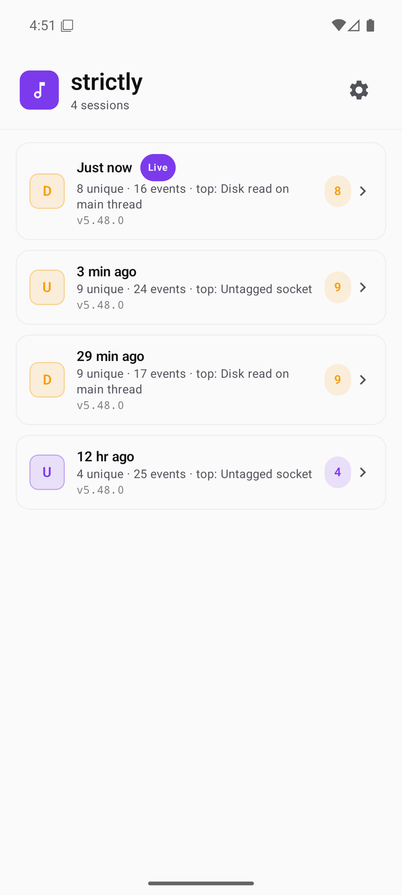
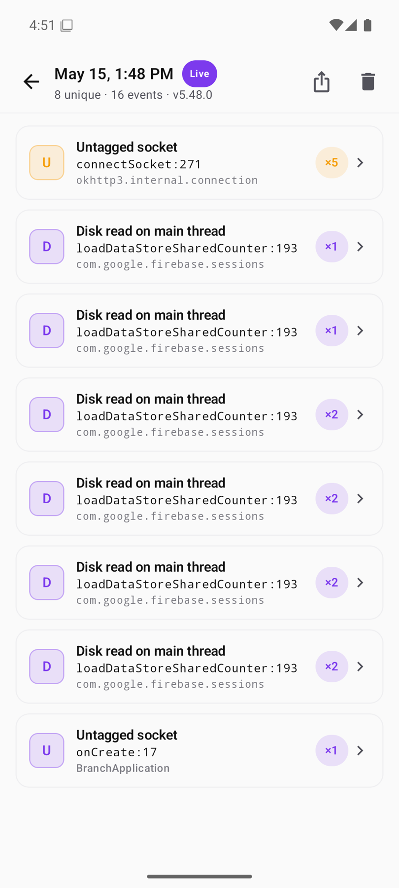
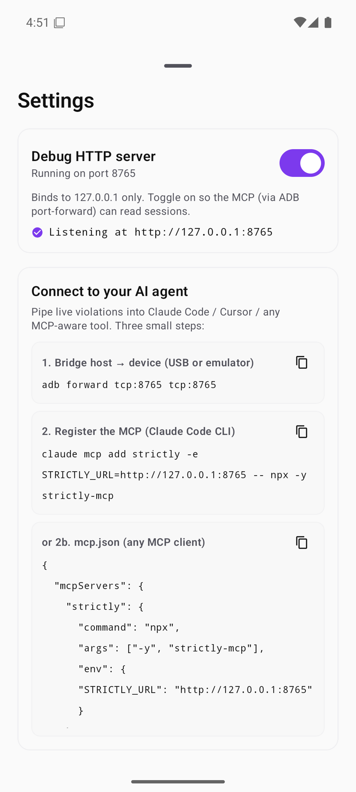

<h1 align="center">Strictly</h1>

<p align="center"><b>See every main-thread violation. Live.</b></p>

<p align="center">
  A debug-only Android library that turns StrictMode from a Logcat firehose into a Chucker-style live experience: one persistent notification, a Compose detail screen, plus a home-screen shortcut for one-tap access.
</p>

<p align="center">
  <a href="https://central.sonatype.com/artifact/io.github.vinaywadhwa.strictly/strictly"></a>
  <a href="https://www.npmjs.com/package/strictly-mcp"></a>
  <a href="https://github.com/vinaywadhwa/Strictly/actions/workflows/ci.yml"></a>
  <a href="LICENSE"></a>
  
</p>

<p align="center">
  
</p>

## Install (two lines)

```kotlin
dependencies {
    debugImplementation("io.github.vinaywadhwa.strictly:strictly:0.1.0")
    releaseImplementation("io.github.vinaywadhwa.strictly:strictly-noop:0.1.0")
}
```

That's the entire setup. Zero `Application` subclass changes. Zero manifest edits. Zero `StrictMode.setThreadPolicy` calls. Strictly auto-installs via a `ContentProvider` and infers your app packages from `applicationId`.

## What you get

<table>
  <tr>
    <td width="50%" valign="top">
      
    </td>
    <td valign="top">
      <h3>Sessions across process lifetimes</h3>
      <p>Every app launch starts a new session. The list shows them most-recently-active first, with a "Live" chip on the current one. Tap any row to drill into the violations that fired during that run. The current session is reactive: violations stream in as they happen.</p>
    </td>
  </tr>
  <tr>
    <td valign="top">
      <h3>Session view, de-duplicated</h3>
      <p>Every violation deduped into a single row with an occurrence count badge. Severity-first ordering. The first app-frame is shown inline so you can scan the worst offender at a glance. Share-icon exports the session as JSON or Markdown for PR comments.</p>
    </td>
    <td width="50%" valign="top">
      
    </td>
  </tr>
  <tr>
    <td width="50%" valign="top">
      
    </td>
    <td valign="top">
      <h3>Per-violation detail</h3>
      <p>Plain-English violation type at the top. Metadata card with count, first / last seen, the thread that tripped it, plus a stable fingerprint. The first app frame is highlighted in the stack, so the line of code that caused it is one glance away.</p>
    </td>
  </tr>
  <tr>
    <td valign="top">
      <h3>Settings + MCP setup, copy-paste ready</h3>
      <p>The settings sheet has a toggle for the opt-in HTTP debug server (loopback only, off by default). Once on, the Connect to your AI agent card has the exact <code>adb forward</code> command. Plus the <code>claude mcp add</code> one-liner. Plus a drop-in <code>mcp.json</code> snippet for any MCP client. Tap the copy icon and paste.</p>
    </td>
    <td width="50%" valign="top">
      
    </td>
  </tr>
  <tr>
    <td width="50%" valign="top">
      
    </td>
    <td valign="top">
      <h3>Long-press shortcut</h3>
      <p>Long-press your app icon on the home screen. Tap <b>Strictly</b>. The detail screen opens. On API 33+, notification permission is requested the first time.</p>
    </td>
  </tr>
</table>

## Touch points

| Surface | When you see it | How to access |
|---|---|---|
| **Live notification** | As soon as the first violation fires | Pull down the shade |
| **Detail screen** | On demand | Tap the notification. Tap the app shortcut. Call `Strictly.openDetailScreen(context)` from code |
| **Long-press shortcut** | On launchers that support shortcuts | Long-press your app icon |
| **Sessions list** | After at least one violation | Back-arrow from the live session. Or open from a cold launch |
| **Per-session export** | Always | Share-icon on a session: JSON or Markdown |
| **`Strictly.violations` flow** | Anywhere in code | `StateFlow<Map<fingerprint, Violation>>` for embedding into a debug menu |
| **HTTP debug server** | Opt-in, settings toggle | Loopback `127.0.0.1:8765`. Surfaces sessions to the MCP plus any HTTP client |

## Ask your AI agent

Strictly ships a companion MCP server, [`strictly-mcp`](strictly-mcp/), that wraps the on-device HTTP server into three Model Context Protocol tools. Once wired up, ask your coding agent things like:

> "What disk reads is my app doing on the main thread right now?"
>
> "Diff the violations between this session and the previous one."
>
> "Show me the stack for that untagged socket and propose a fix."

Setup is two commands plus a toggle:

```sh
adb forward tcp:8765 tcp:8765
claude mcp add strictly -e STRICTLY_URL=http://127.0.0.1:8765 -- npx -y strictly-mcp
```

Then in the app, open Strictly via the home-screen shortcut, tap the gear icon. Toggle "Debug HTTP server" on. The settings sheet also shows ready-to-paste `mcp.json` for non-Claude clients.

The server binds loopback only. Off by default. No data leaves the device.

## Production safety

Release builds wire the no-op artifact. Zero classes loaded. Zero ContentProvider registered. Zero notification channels created. Nothing about Strictly ships to users.

## Configure if you must

Defaults are tuned for "drop in, see violations, never spam". Override only if you need to.

```kotlin
class MyApplication : Application() {
    override fun onCreate() {
        super.onCreate()
        Strictly.install(
            this,
            StrictlyConfig(
                appPackages = listOf("com.acme.", "com.acme.lending."),
                ignoredPackages = StrictlyConfig.DEFAULT_IGNORED_PACKAGES + listOf(
                    "com.acme.thirdparty.",
                ),
                detectedTypes = ViolationType.entries.toSet() - ViolationType.ResourceMismatch,
                maxStoredSessions = 50,
                notificationUpdateDebounceMillis = 500,
                registerAppShortcut = true,
                httpDebugPort = 8765,
                httpDebugAutoStart = false,
                httpDebugSecret = null,
            ),
        )
    }
}
```

| Setting | Default | Purpose |
|---|---|---|
| `appPackages` | inferred from `applicationId` | Frames matching these prefixes are highlighted, plus preferred for fingerprinting |
| `ignoredPackages` | small list of known-noisy framework SDKs | Violations whose first app-frame is in this list are silently dropped |
| `detectedTypes` | all | Trim to skip noisy detectors |
| `maxStoredSessions` | 20 | Bounded LRU of archived sessions on disk. Oldest evicted when full |
| `notificationUpdateDebounceMillis` | 500 | Maximum notification update frequency under load |
| `registerAppShortcut` | true | Adds the long-press shortcut on launchers that support it |
| `httpDebugPort` | 8765 | Port for the opt-in HTTP debug server. Change if 8765 is taken on your device |
| `httpDebugAutoStart` | false | Auto-start the HTTP server on `Strictly.install` (eg: useful in CI). Otherwise off until toggled |
| `httpDebugSecret` | null | Optional `X-Strictly-Secret` header value. Belt-and-braces over loopback isolation |

## Why Strictly

StrictMode is one of Android's most underused tools because its default output is awkward:

- `penaltyLog` floods Logcat where violations are easy to miss
- `penaltyDeath` crashes debug builds out of the dev's flow
- Per-violation toasts spam during scroll storms
- No way to see "everything I've tripped this session"

Strictly fixes the surface, not the policy. Under the hood it's still vanilla `StrictMode` with a custom `penaltyListener`. The listener routes into a de-duplicating store, a debounced notification, plus a Compose UI.

Pairs naturally with [LeakCanary](https://square.github.io/leakcanary/) (memory leaks) plus [Chucker](https://github.com/ChuckerTeam/chucker) (network).

## Comparison

| | LeakCanary | Chucker | **Strictly** |
|---|---|---|---|
| Detects | Memory leaks | Network calls | Main-thread violations plus VM violations |
| Surface | Notification + detail screen | Notification + detail screen | Notification + detail screen |
| Auto-init | yes | yes | yes |
| App shortcut | yes | yes | yes |
| No-op release artifact | yes | yes | yes |
| Cross-session history | no | no | yes (LRU on disk) |
| MCP server for AI agents | no | no | yes (`strictly-mcp` on npm) |
| Per-session export (JSON / Markdown) | no | no | yes |

## Requirements

- **minSdk 21** to compile. Strictly itself is debug-only.
- **API 28+** for the live notification plus detail UI. On API 21 through 27, Strictly installs a sensible Logcat-only policy. The UI surfaces are no-ops.
- **API 33+** prompts for `POST_NOTIFICATIONS` the first time you open the detail screen via the home-screen shortcut.

## Programmatic entry points

```kotlin
Strictly.openDetailScreen(context)         // jump straight to the UI
Strictly.violations                        // StateFlow<Map<fingerprint, Violation>> for the live session
Strictly.sessions                          // StateFlow<List<SessionSummary>> across all persisted sessions
Strictly.currentSessionId                  // String, useful for correlating with crash reports
Strictly.loadSession(id)                   // Session? from live or archived storage
Strictly.clearCurrent()                    // wipe the live session
Strictly.deleteSession(id)                 // delete a specific archived session
Strictly.wipeAllSessions()                 // nuke everything from disk plus memory
Strictly.isLiveListeningSupported          // false on API < 28
Strictly.DebugHttp.setEnabled(true)        // turn on the HTTP server programmatically
Strictly.DebugHttp.running                 // StateFlow<Boolean>
```

<details>
<summary><b>How it works</b></summary>

```
StrictMode listener  ->  classify  ->  fingerprint  ->  SessionStore (LRU on disk + StateFlow)
                                                                |
                                                                +->  LiveNotificationController (debounced 500ms)
                                                                |
                                                                +->  StrictlyActivity (Compose state machine)
                                                                |
                                                                +->  StrictlyHttpServer (opt-in, loopback)  ->  strictly-mcp
```

- A single-thread executor handles the `OnThreadViolationListener` plus `OnVmViolationListener` callbacks. Per-callback work stays small. Classify the subtype by simple-class-name. Map to a domain model. Compute a fingerprint over the violation type plus the first 3 app-frames (classes only, no line numbers). Upsert into the store.
- `SessionStore` exposes the live session as a `StateFlow<Map<fingerprint, Violation>>`. Three surfaces subscribe to that flow. The notification. The Compose UI. The HTTP debug server. No polling anywhere.
- The notification subscribes through a `debounce(500ms)` flow. A burst of 200 identical violations in 50ms produces one notification update.
- Past sessions persist to an LRU on disk (bounded by `maxStoredSessions`). On launch the index loads first. Individual session bodies load on demand.
- The HTTP debug server is opt-in. Off by default. Loopback-only. Serves the same JSON the file persister writes. The `strictly-mcp` Node process wraps it as three MCP tools.
- Self-instrumentation: the listener body runs inside `StrictMode.allowThreadDiskReads()` so Strictly never trips its own policy.
- The on-disk schema is pinned by a golden test. Bumping it requires a deliberate code change plus a snapshot update.

</details>

<details>
<summary><b>Opting out of auto-init</b></summary>

To install Strictly manually (eg: if you need to set your own config *before* the first user-code line runs), disable the bundled provider in your debug manifest:

```xml
<application>
    <provider
        android:name="com.vwap.strictly.internal.StrictlyAutoInitProvider"
        android:authorities="${applicationId}.strictly-auto-init"
        tools:node="remove" />
</application>
```

Then call `Strictly.install(this, yourConfig)` from your `Application.onCreate`.

</details>

## Roadmap

- Baseline file checked into the repo, with `assertNoNewViolations()` for instrumented tests
- Cross-session diff screen: "what's new since the last clean run"
- Filter chips in the detail screen (by type, by package, by severity)
- A first-class CI mode that fails the build on net-new violations against a checked-in baseline

## License

Apache 2.0. See [LICENSE](LICENSE) for the full text.
